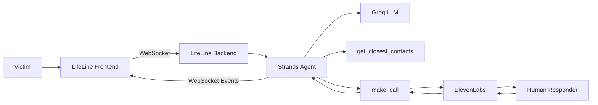
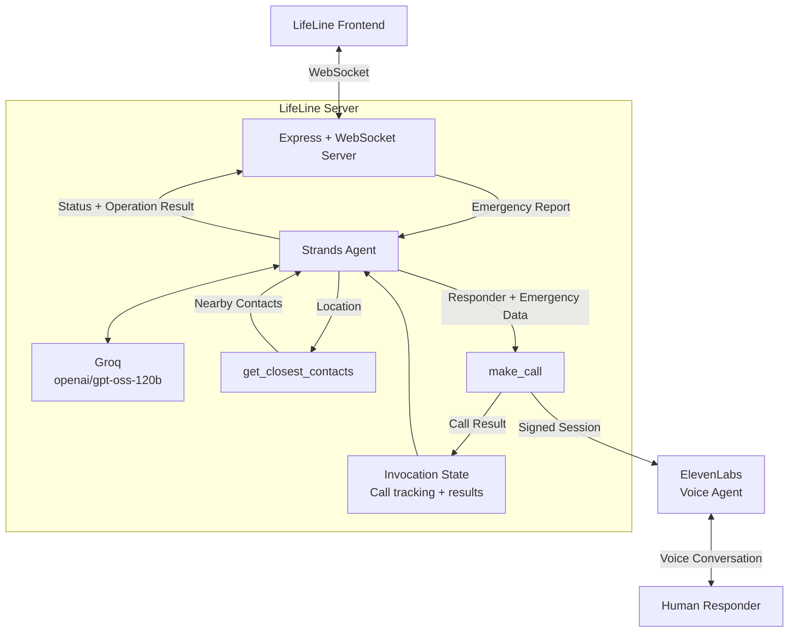

# lifeline-hackathon-aws

## Frontend

# LifeLine

LifeLine is an AI-powered emergency response coordination interface built for the **AWS Agents for Humans Hackathon**.

The frontend provides the interface through which a victim reports an emergency and monitors the response as the LifeLine agent coordinates assistance.

The frontend communicates with a separate backend service over WebSockets. The backend uses a **Strands Agent** to analyze the emergency, identify nearby contacts, and coordinate calls to responders. **ElevenLabs Conversational AI** provides the voice interface used by LifeLine to communicate with human responders.

> **Hackathon prototype:** Contact and responder information used in the demonstration is synthetic and is not connected to real emergency services.

---

## Overview

The LifeLine frontend is designed around an emergency-response workflow rather than a conventional chatbot.

A victim describes an emergency, after which the system:

1. Sends the emergency report to the LifeLine backend.
2. Displays the agent's live operational status.
3. Receives incoming responder call events.
4. Allows the user to accept or decline a call.
5. Establishes an ElevenLabs voice session when a call is accepted.
6. Displays the active call interface.
7. Reports the result of each responder interaction.
8. Displays a final operation summary when the response cycle is complete.

The interface is intentionally designed to resemble an emergency operations system, with a phone-oriented interaction area and a live operational console.

---

## System Architecture

The frontend is one part of the larger LifeLine system.



### Components

**LifeLine Frontend**

The Next.js application responsible for:

- Emergency input
- Live agent activity
- Incoming call UI
- Voice call UI
- Call controls
- Operation progress
- Final operation summary

**LifeLine Backend**

The backend contains the Strands Agent and coordination tools.

It is responsible for:

- Receiving emergency reports
- Running the Strands Agent
- Finding nearby contacts
- Coordinating responder calls
- Managing ElevenLabs sessions
- Tracking call outcomes
- Sending real-time events to the frontend

**Strands Agent**

Strands acts as the orchestration layer.

It determines:

- What information is relevant to the emergency
- Which contacts should be contacted
- The order in which they should be contacted
- When to initiate the next call
- How to continue after each call completes

**Groq**

Groq provides the LLM used by the Strands Agent.

**ElevenLabs**

ElevenLabs provides the voice interaction between LifeLine and the human responder.

The ElevenLabs agent does **not** communicate directly with the victim. It represents LifeLine during the responder call.

---

## Repositories

### Frontend

This repository contains the LifeLine user interface.

### Backend

The backend contains the Strands Agent, WebSocket server, emergency coordination tools, contact data, and ElevenLabs orchestration.

**Backend repository:**

https://github.com/Ojiesuwa/lifeline-server-hackathon

---

## Technology Stack

### Frontend

- **Next.js 16**
- **React 19**
- **TypeScript**
- **WebSockets**
- **ElevenLabs Client SDK**
- **Framer Motion**
- **Lucide React**
- **CSS / CSS Modules**

### Backend

The frontend communicates with a backend built using:

- **Node.js**
- **Express**
- **WebSocket (`ws`)**
- **Strands Agents SDK**
- **Groq**
- **ElevenLabs**

---

# Application Flow

## 1. Emergency Report

The user begins by describing the emergency.

The interface provides a text input containing an example emergency report which can be edited by the user.

Example:

```text
I'm having a really bad asthma attack right now. I'm struggling to breathe and my inhaler isn't helping much. I'm wheezing badly and finding it difficult to talk or even stand properly. I'm at 15 Marina Road, Lagos Island. Please send medical help as soon as possible.
```

When the user starts the incident, the frontend sends a WebSocket message:

```json
{
  "type": "START_INCIDENT",
  "emergency": "Emergency description..."
}
```

---

## 2. Agent Activity

After the incident starts, the frontend displays live updates from the backend.

Examples include:

- `ANALYZING_EMERGENCY`
- `FINDING_RESPONDERS`
- `RESPONDERS_FOUND`
- `CONTACTING_RESPONDER`
- `CALL_COMPLETED`

These events allow the user to see what the emergency coordination system is currently doing instead of waiting on a blank loading screen.

The frontend intentionally displays **safe operational status information** rather than exposing the model's private internal reasoning.

---

## 3. Responder Discovery

The Strands Agent uses the backend's `get_closest_contacts` tool to identify contacts near the emergency location.

The tool receives the emergency coordinates and calculates distances using geographic coordinates.

The returned contacts can include:

- Emergency services
- Relatives
- Friends
- Neighbors

The agent then determines the order in which the contacts should be called.

The frontend does not perform responder selection itself. It receives the resulting events from the backend.

---

## 4. Incoming Call

When the backend begins a responder call, the frontend receives a `START_CALL` WebSocket event.

The event contains the ElevenLabs session information and the emergency context required for the call.

The frontend then switches to the incoming-call interface.

The incoming call UI provides:

- Caller information
- Animated call indicators
- Ringtone
- Accept button
- Decline button

---

## 5. Accepting a Call

When the user accepts a call, the browser requests microphone access.

The frontend then starts an ElevenLabs conversation session using the signed session URL provided by the backend.

Dynamic emergency information is supplied to the ElevenLabs agent, including information such as:

- Emergency context
- Victim name
- Responder name
- Victim location
- Responder distance
- Time since the incident was reported
- Victim relationship to the responder
- Number of people already contacted

The voice agent uses this information to communicate the emergency to the human responder.

---

## 6. Active Call

After the ElevenLabs session connects, the frontend switches to the active-call interface.

The active call screen displays:

- Connection state
- Responder information
- Call duration
- Animated audio activity
- End-call control

The frontend does not attempt to perform emergency reasoning during the call. Its role is to provide the interaction layer while the voice agent communicates with the responder.

---

## 7. Call Completion

When a call ends, the frontend sends:

```json
{
  "type": "CALL_ENDED"
}
```

The backend uses this event to resolve the current call operation and allows the Strands Agent to continue to the next responder.

This produces a sequential workflow:

```text
Find responders
      ↓
Call responder 1
      ↓
Wait for result
      ↓
Call responder 2
      ↓
Wait for result
      ↓
Call responder 3
      ↓
...
```

Only one responder call is active at a time.

---

## 8. Operation Summary

After every selected contact has been processed, the backend sends an `OPERATION_COMPLETE` event.

The frontend displays the final operation summary.

The summary includes:

- Total people called
- Total call duration
- Responders who picked up
- Responders who declined
- Failed calls
- Individual call durations

This gives the user a clear view of the outcome of the emergency coordination process.

---

# WebSocket Protocol

The frontend communicates with the backend using WebSockets.

## Server → Client Events

### `CONNECTED`

Sent when the WebSocket connection is established.

```json
{
  "type": "CONNECTED"
}
```

### `AGENT_STATUS`

Provides a safe operational update.

```json
{
  "type": "AGENT_STATUS",
  "status": "FINDING_RESPONDERS",
  "message": "Finding emergency responders near the reported location..."
}
```

### `START_CALL`

Indicates that the backend has initiated a responder call.

```json
{
  "type": "START_CALL",
  "session": "signed-elevenlabs-session-url",
  "data": {
    "emergency_context": "...",
    "victim_name": "...",
    "line_name": "...",
    "victim_location": "...",
    "responder_distance_km": 2.4,
    "time_differential": "2 minutes ago",
    "victim_relationship": "Sister",
    "called_individuals_count": 1
  }
}
```

### `CALL_STARTED`

Indicates that the call interface should transition into the active call state.

### `AGENT_ACTIVE`

Indicates that the agent is currently active in the response flow.

### `OPERATION_COMPLETE`

Indicates that the responder coordination cycle has finished.

Example:

```json
{
  "type": "OPERATION_COMPLETE",
  "summary": {
    "totalPeopleCalled": 5,
    "pickedUp": [],
    "declined": [],
    "failed": [],
    "totalCallDurationMs": 42000
  }
}
```

---

## Client → Server Events

### `START_INCIDENT`

Starts a new emergency response operation.

```json
{
  "type": "START_INCIDENT",
  "emergency": "Emergency description..."
}
```

### `CALL_ACCEPTED`

Sent when the user accepts an incoming responder call.

```json
{
  "type": "CALL_ACCEPTED"
}
```

### `CALL_DECLINED`

Sent when the user declines an incoming responder call.

```json
{
  "type": "CALL_DECLINED"
}
```

### `CALL_ENDED`

Sent when an active ElevenLabs call is ended.

```json
{
  "type": "CALL_ENDED"
}
```

---

# Frontend Structure

```text
.
├── public/
│   ├── call.mp3
│   └── phone.png
│
├── src/
│   ├── app/
│   │   ├── globals.css
│   │   ├── layout.tsx
│   │   ├── page.css
│   │   └── page.tsx
│   │
│   └── components/
│       ├── ActiveCall/
│       │   ├── ActiveCall.css
│       │   └── ActiveCall.tsx
│       │
│       ├── BottomGlow/
│       │   ├── BottomGlow.module.css
│       │   └── BottomGlow.tsx
│       │
│       ├── ClockUI/
│       │   ├── ClockUI.css
│       │   └── ClockUI.tsx
│       │
│       └── IncomingCall/
│           ├── IncomingCall.css
│           └── IncomingCall.tsx
│
├── AGENTS.md
├── CLAUDE.md
├── eslint.config.mjs
├── next-env.d.ts
├── next.config.ts
├── package.json
├── README.md
└── tsconfig.json
```

---

# Environment and Deployment

The frontend communicates with the LifeLine backend through a secure WebSocket connection in production.

### Production WebSocket

```text
wss://lifeline-server-hackathon.onrender.com/
```

The backend is hosted separately from the Next.js frontend.

### Local Development

When running the backend locally:

```text
ws://localhost:4000/
```

The frontend should use the appropriate WebSocket URL for the current environment.

---

# Running Locally

## Prerequisites

- Node.js
- npm
- A running LifeLine backend
- ElevenLabs access for voice calls

## Installation

Clone the repository and install dependencies:

```bash
git clone https://github.com/Ojiesuwa/lifeline-frontend-hackathon.git
cd lifeline-frontend-hackathon
npm install
```

## Start the development server

```bash
npm run dev
```

The frontend will be available at:

```text
http://localhost:3000
```

Make sure the LifeLine backend is also running.

---

# Available Scripts

```bash
npm run dev
```

Starts the Next.js development server.

```bash
npm run build
```

Creates a production build.

```bash
npm run start
```

Starts the production Next.js server.

```bash
npm run lint
```

Runs ESLint.

---

# Design

The interface is designed around an emergency operations experience rather than a traditional AI chat interface.

The main design principles are:

- Clear emergency states
- Minimal interaction during critical operations
- Immediate visual feedback
- Live operational status
- Distinct incoming and active call states
- Clear operation results
- Mobile-phone-inspired emergency interaction
- Animated transitions to communicate system state

The frontend uses **Framer Motion** for transitions and animations and **Lucide React** for interface icons.

---

# Reliability Considerations

The frontend includes protections around the real-time call flow, including:

- Persistent WebSocket communication
- WebSocket reconnection handling
- Prevention of duplicate call acceptance
- Cleanup of ElevenLabs sessions
- Cleanup of WebSocket listeners
- Explicit call state management
- Separate incoming, active, and idle states
- Operation completion handling

The frontend also avoids exposing backend credentials such as the Groq or ElevenLabs API keys. ElevenLabs session credentials are generated by the backend.

---

# Security

API keys and provider credentials are kept on the backend.

The frontend should never contain:

```text
GROQ_API_KEY
ELEVENLABS_API_KEY
```

The frontend only receives the information required to establish the relevant voice session.

---

# Project Status

LifeLine is a **hackathon prototype** demonstrating AI-assisted emergency response coordination.

The project demonstrates:

- Emergency intake
- AI agent orchestration
- Responder discovery
- Sequential responder coordination
- Real-time WebSocket communication
- Voice-based responder interaction
- Live operational status
- Call outcome tracking
- Final operation summaries

It is **not a production emergency dispatch platform** and should not be used to contact real emergency services.

The responder and contact information used in the demonstration is synthetic.

---

# Hackathon Context

LifeLine was built for the **AWS Agents for Humans Hackathon**.

The project demonstrates an agentic workflow in which an AI agent does more than generate a response. It receives an emergency situation, uses tools to identify appropriate contacts, coordinates calls, waits for their outcomes, and continues the response process based on those results.

The frontend provides the human-facing operational interface for that workflow.

---

# License

This project is licensed under the **MIT License**.

See [`LICENSE`](./LICENSE) for details.

## Server

# LifeLine Server

The LifeLine Server is the backend orchestration layer for **LifeLine**, an AI-powered emergency response coordination system built for the **AWS Agents for Humans Hackathon**.

The server receives emergency reports from the LifeLine frontend, passes them to a **Strands Agent**, and coordinates the emergency response using specialized tools.

The agent can identify nearby contacts, initiate responder calls through **ElevenLabs**, wait for each call to complete, track the outcome, and continue contacting additional responders.

> **Hackathon prototype:** Contact and responder information used in the demonstration is synthetic and is not connected to real emergency services.

---

# Architecture



---

# How It Works

LifeLine uses an agentic workflow rather than a fixed sequence of backend functions.

The Strands Agent decides how to coordinate the emergency using the tools available to it.

The high-level flow is:

```text
Emergency Report
       ↓
Strands Agent
       ↓
Identify Emergency Location
       ↓
get_closest_contacts
       ↓
Nearby Responders
       ↓
make_call
       ↓
ElevenLabs
       ↓
Human Responder
       ↓
Call Result
       ↓
Strands Agent
       ↓
Next Responder
       ↓
Operation Complete
```

The agent waits for each responder call to finish before moving to the next responder.

---

# Core Components

## WebSocket Server

The server uses **Express** and the `ws` package to maintain a persistent connection with the LifeLine frontend.

The WebSocket connection allows the backend to push events to the frontend in real time.

The server communicates events such as:

- Agent status
- Responder discovery
- Call initiation
- Call completion
- Operation completion

The WebSocket server runs on port `4000` during local development.

---

# Strands Agent

The Strands Agent is the central orchestration layer.

It receives the emergency report and is responsible for coordinating the response.

The agent is configured with:

- A Groq-powered model
- `get_closest_contacts`
- `make_call`
- Emergency coordination instructions
- Invocation state for tracking the current operation

The agent is explicitly instructed to:

1. Understand the emergency.
2. Identify the emergency location.
3. Find nearby contacts.
4. Review the returned contacts.
5. Contact the selected contacts sequentially.
6. Wait for each call to finish.
7. Record the outcome.
8. Continue until all selected contacts have been processed.

The agent does not expose its private chain-of-thought to the frontend. Instead, the server sends safe operational status events.

---

# Model

LifeLine uses **Groq** as the model provider through the OpenAI-compatible interface supported by the Strands TypeScript SDK.

The current model is:

```text
openai/gpt-oss-120b
```

The Strands configuration uses the Groq OpenAI-compatible API endpoint.

Conceptually:

```text
Strands Agent
      ↓
OpenAIModel
      ↓
Groq API
      ↓
openai/gpt-oss-120b
```

This allows the project to use Strands for agent orchestration while using Groq as the underlying model provider.

---

# Agent Tools

The agent currently has two primary tools.

## `get_closest_contacts`

This tool identifies the closest contacts to the emergency location.

It receives only:

```json
{
  "latitude": 6.4558,
  "longitude": 3.3892
}
```

The tool calculates geographic distance using the Haversine formula.

It combines contacts from:

- Emergency services
- Relatives
- Friends
- Neighbors

The contacts are then sorted by distance.

Example result:

```json
[
  {
    "name": "Sarah Ojo",
    "type": "relative",
    "relationship": "Sister",
    "distance": 0.42
  },
  {
    "name": "Lagos Fire Service",
    "type": "fire_service",
    "distance": 0.91
  }
]
```

The tool prevents the model from needing to process the entire contact database itself.

Instead, the agent supplies the emergency coordinates and receives a focused list of nearby contacts.

---

# `make_call`

`make_call` is responsible for initiating a voice call to a selected responder.

The tool receives emergency and responder information including:

- Emergency context
- Victim name
- Responder name
- Victim location
- Responder distance
- Emergency trigger time
- Victim relationship to the responder

The tool then:

1. Calculates how long ago the emergency was reported.
2. Reads the current invocation state.
3. Generates an ElevenLabs signed session URL.
4. Sends a `START_CALL` event to the frontend.
5. Waits for the frontend to complete or decline the call.
6. Records the call outcome.
7. Returns the result to the Strands Agent.

This allows the agent to reason about the result of each call before proceeding.

---

# ElevenLabs Integration

ElevenLabs provides the voice interface used during responder calls.

The architecture is:

```text
Strands Agent
      ↓
make_call
      ↓
ElevenLabs Signed URL
      ↓
Frontend
      ↓
ElevenLabs Voice Session
      ↓
Human Responder
```

The ElevenLabs agent represents **LifeLine during the responder call**.

It communicates information such as:

- What happened
- Where the emergency occurred
- Who is affected
- How long ago the emergency was reported
- Relevant relationship information
- The approximate distance from the responder

The ElevenLabs API key remains on the backend.

The frontend receives a temporary signed session URL rather than the permanent API credential.

---

# Invocation State

LifeLine uses Strands invocation state to maintain information throughout an emergency response operation.

The state tracks information such as:

```javascript
{
  calledIndividualsCount: 0,
  pickedUp: [],
  declined: [],
  failed: [],
  totalCallDurationMs: 0
}
```

This state persists across tool invocations during the agent's current operation.

For example:

```text
make_call #1
    ↓
calledIndividualsCount = 1
    ↓
make_call #2
    ↓
calledIndividualsCount = 2
```

At the end of the operation, the server converts this state into a summary and sends it to the frontend.

---

# Sequential Response Coordination

A key design decision is that responder calls are made **sequentially**.

The agent is instructed not to initiate multiple calls simultaneously.

Instead:

```text
Responder A
    ↓
Wait for call result
    ↓
Responder B
    ↓
Wait for call result
    ↓
Responder C
    ↓
Wait for call result
    ↓
Operation Complete
```

This makes the call state deterministic and prevents multiple active responder sessions from interfering with one another.

---

# WebSocket Protocol

## Client → Server

### `START_INCIDENT`

Starts a new emergency operation.

```json
{
  "type": "START_INCIDENT",
  "emergency": "There is a fire at 15 Marina Road..."
}
```

### `CALL_ACCEPTED`

Indicates that the user accepted the current responder call.

```json
{
  "type": "CALL_ACCEPTED"
}
```

### `CALL_DECLINED`

Indicates that the user declined the current responder call.

```json
{
  "type": "CALL_DECLINED"
}
```

### `CALL_ENDED`

Indicates that the current voice session has ended.

```json
{
  "type": "CALL_ENDED"
}
```

---

# Server → Client

## `CONNECTED`

Sent when a WebSocket connection is established.

```json
{
  "type": "CONNECTED"
}
```

## `AGENT_STATUS`

Provides a safe operational status update.

Example:

```json
{
  "type": "AGENT_STATUS",
  "status": "FINDING_RESPONDERS",
  "message": "Finding emergency responders near the reported location..."
}
```

Possible statuses include:

```text
ANALYZING_EMERGENCY
FINDING_RESPONDERS
RESPONDERS_FOUND
CONTACTING_RESPONDER
CALL_COMPLETED
```

These statuses communicate what the system is doing without exposing private model reasoning.

---

## `START_CALL`

Tells the frontend that a responder call should begin.

Example:

```json
{
  "type": "START_CALL",
  "session": "signed-elevenlabs-url",
  "data": {
    "emergency_context": "Severe asthma attack",
    "victim_name": "Patrick Jane",
    "line_name": "Emergency Medical Service",
    "victim_location": "15 Marina Road, Lagos Island",
    "responder_distance_km": 1.7,
    "time_differential": "2 minutes ago",
    "victim_relationship": "Unknown",
    "called_individuals_count": 1
  }
}
```

---

## `OPERATION_COMPLETE`

Sent when the emergency coordination cycle finishes.

Example:

```json
{
  "type": "OPERATION_COMPLETE",
  "summary": {
    "totalPeopleCalled": 5,
    "pickedUp": [],
    "declined": [],
    "failed": [],
    "totalCallDurationMs": 42000
  }
}
```

---

# Project Structure

```text
lifeline-server/
│
├── src/
│   ├── data/
│   │   └── data.js
│   │
│   ├── tools/
│   │   ├── call.js
│   │   └── contact.js
│   │
│   ├── utils/
│   │   └── getElevenLabsSignedUrl.js
│   │
│   ├── agent.js
│   └── server.js
│
├── .env
├── .gitignore
├── package.json
├── package-lock.json
├── README.md
└── LICENSE
```

---

# File Responsibilities

## `src/server.js`

Creates the Express HTTP server and WebSocket server.

Responsibilities include:

- Accepting frontend connections
- Receiving emergency reports
- Creating the Strands Agent
- Starting agent invocations
- Sending agent status events
- Returning the final operation summary

---

## `src/agent.js`

Creates and configures the Strands Agent.

Responsibilities include:

- Configuring the Groq model
- Defining the agent system prompt
- Registering tools
- Registering Strands hooks
- Sending safe agent status events

---

## `src/tools/contact.js`

Contains the `get_closest_contacts` tool.

Responsibilities include:

- Loading contact data
- Calculating geographic distances
- Sorting contacts
- Returning the closest contacts

---

## `src/tools/call.js`

Contains the `make_call` tool.

Responsibilities include:

- Preparing responder call information
- Generating ElevenLabs sessions
- Starting calls through the frontend
- Waiting for call completion
- Tracking call results
- Updating invocation state

---

## `src/utils/getElevenLabsSignedUrl.js`

Generates temporary ElevenLabs signed URLs.

The ElevenLabs API key is only accessed by the backend.

---

# Data

The current demonstration uses synthetic responder and contact data.

The dataset contains examples of:

- Fire services
- Police
- Hospitals
- Ambulance services
- Rescue services
- Emergency management
- Medical response
- Search and rescue
- Relatives
- Friends
- Neighbors

These records exist solely to demonstrate the agent workflow.

They are **not real emergency service contacts**.

---

# Environment Variables

Create a `.env` file in the server root:

```env
GROQ_API_KEY=your_groq_api_key
ELEVENLABS_API_KEY=your_elevenlabs_api_key
ELEVENLABS_AGENT_ID=your_elevenlabs_agent_id
```

Never commit `.env` to GitHub.

Your `.gitignore` should contain:

```gitignore
.env
node_modules/
```

---

# Installation

Clone the repository:

```bash
git clone https://github.com/Ojiesuwa/lifeline-server-hackathon.git
```

Enter the project:

```bash
cd lifeline-server-hackathon
```

Install dependencies:

```bash
npm install
```

Create the environment file:

```bash
cp .env.example .env
```

Then configure the required API credentials.

---

# Running Locally

Start the development server:

```bash
npm run dev
```

The WebSocket server runs on:

```text
ws://localhost:4000
```

The LifeLine frontend can then connect to the server and initiate emergency operations.

---

# Production Deployment

The LifeLine backend is deployed on **Render**.

Production WebSocket endpoint:

```text
wss://lifeline-server-hackathon.onrender.com/
```

The frontend uses this secure WebSocket endpoint when communicating with the deployed backend.

---

# Real-Time Agent Status

The server uses Strands lifecycle hooks to communicate safe operational states to the frontend.

For example:

```text
ANALYZING_EMERGENCY
        ↓
FINDING_RESPONDERS
        ↓
RESPONDERS_FOUND
        ↓
CONTACTING_RESPONDER
        ↓
CALL_COMPLETED
        ↓
CONTACTING_RESPONDER
        ↓
CALL_COMPLETED
        ↓
OPERATION_COMPLETE
```

These events provide visibility into the agent's progress without exposing private chain-of-thought or internal reasoning.

---

# Error Handling

The backend tracks three major call outcomes:

### Picked Up

The responder call completed normally.

```text
pickedUp[]
```

### Declined

The responder declined the incoming call.

```text
declined[]
```

### Failed

The call could not be successfully initiated or completed.

```text
failed[]
```

The operation summary also tracks the total time spent across responder calls.

---

# Security Considerations

Provider API keys are kept exclusively on the backend.

The following credentials must never be exposed to the frontend:

```text
GROQ_API_KEY
ELEVENLABS_API_KEY
```

ElevenLabs sessions are created server-side using temporary signed URLs.

The frontend receives only the information necessary to establish the current voice session.

---

# Design Decisions

## Why WebSockets?

Emergency coordination is inherently event-driven.

The frontend needs to receive events such as:

- Responder discovery
- Call initiation
- Call completion
- Agent status
- Operation completion

WebSockets provide persistent bidirectional communication without requiring repeated polling.

## Why Strands?

Strands provides the agent orchestration layer.

Instead of implementing a rigid sequence of backend function calls, the system gives the model access to tools and allows the agent to determine how to coordinate the response.

## Why Separate Tools?

Responder discovery and responder communication are separate responsibilities.

`get_closest_contacts` handles:

```text
Location → Nearby contacts
```

while `make_call` handles:

```text
Responder + Emergency information → Voice call → Call result
```

This keeps the agent's capabilities modular.

---

# Hackathon Relevance

LifeLine demonstrates an agentic emergency-response workflow where the AI system can:

- Understand an emergency report
- Use tools to discover relevant responders
- Coordinate external actions
- Interact with humans through voice
- Wait for action results
- Continue the workflow based on those results
- Maintain state throughout an operation

The Strands Agent is therefore not being used simply as a chatbot. It acts as the orchestration layer responsible for coordinating multiple tools and external interactions.

---

# Project Status

LifeLine is a **hackathon prototype**.

The current implementation demonstrates:

- Strands Agent orchestration
- Groq model integration
- Real-time WebSocket communication
- Geographic responder discovery
- Tool-based responder coordination
- ElevenLabs voice integration
- Sequential emergency calls
- Invocation state tracking
- Call outcome tracking
- Live agent status updates
- Operation summaries

It is **not a production emergency dispatch system** and should not be used to contact real emergency services.

All demonstration responder data is synthetic.

---

# License

This project is licensed under the **MIT License**.

See [`LICENSE`](./LICENSE) for the complete license text.
