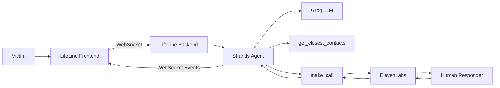

# LifeLine

LifeLine is an AI-powered emergency response coordination interface built for the **AWS Agents for Humans Hackathon**.

The frontend provides the interface through which a victim reports an emergency and monitors the response as the LifeLine agent coordinates assistance.

The frontend communicates with a separate backend service over WebSockets. The backend uses a **Strands Agent** to analyze the emergency, identify nearby contacts, and coordinate calls to responders. **ElevenLabs Conversational AI** provides the voice interface used by LifeLine to communicate with human responders.

> **Hackathon prototype:** Contact and responder information used in the demonstration is synthetic and is not connected to real emergency services.

---

## Overview

The LifeLine frontend is designed around an emergency-response workflow rather than a conventional chatbot.

A victim describes an emergency, after which the system:

1. Sends the emergency report to the LifeLine backend.
2. Displays the agent's live operational status.
3. Receives incoming responder call events.
4. Allows the user to accept or decline a call.
5. Establishes an ElevenLabs voice session when a call is accepted.
6. Displays the active call interface.
7. Reports the result of each responder interaction.
8. Displays a final operation summary when the response cycle is complete.

The interface is intentionally designed to resemble an emergency operations system, with a phone-oriented interaction area and a live operational console.

---

## System Architecture

The frontend is one part of the larger LifeLine system.



### Components

**LifeLine Frontend**

The Next.js application responsible for:

- Emergency input
- Live agent activity
- Incoming call UI
- Voice call UI
- Call controls
- Operation progress
- Final operation summary

**LifeLine Backend**

The backend contains the Strands Agent and coordination tools.

It is responsible for:

- Receiving emergency reports
- Running the Strands Agent
- Finding nearby contacts
- Coordinating responder calls
- Managing ElevenLabs sessions
- Tracking call outcomes
- Sending real-time events to the frontend

**Strands Agent**

Strands acts as the orchestration layer.

It determines:

- What information is relevant to the emergency
- Which contacts should be contacted
- The order in which they should be contacted
- When to initiate the next call
- How to continue after each call completes

**Groq**

Groq provides the LLM used by the Strands Agent.

**ElevenLabs**

ElevenLabs provides the voice interaction between LifeLine and the human responder.

The ElevenLabs agent does **not** communicate directly with the victim. It represents LifeLine during the responder call.

---

## Repositories

### Frontend

This repository contains the LifeLine user interface.

### Backend

The backend contains the Strands Agent, WebSocket server, emergency coordination tools, contact data, and ElevenLabs orchestration.

**Backend repository:**

https://github.com/Ojiesuwa/lifeline-server-hackathon

---

## Technology Stack

### Frontend

- **Next.js 16**
- **React 19**
- **TypeScript**
- **WebSockets**
- **ElevenLabs Client SDK**
- **Framer Motion**
- **Lucide React**
- **CSS / CSS Modules**

### Backend

The frontend communicates with a backend built using:

- **Node.js**
- **Express**
- **WebSocket (`ws`)**
- **Strands Agents SDK**
- **Groq**
- **ElevenLabs**

---

# Application Flow

## 1. Emergency Report

The user begins by describing the emergency.

The interface provides a text input containing an example emergency report which can be edited by the user.

Example:

```text
I'm having a really bad asthma attack right now. I'm struggling to breathe and my inhaler isn't helping much. I'm wheezing badly and finding it difficult to talk or even stand properly. I'm at 15 Marina Road, Lagos Island. Please send medical help as soon as possible.
```

When the user starts the incident, the frontend sends a WebSocket message:

```json
{
  "type": "START_INCIDENT",
  "emergency": "Emergency description..."
}
```

---

## 2. Agent Activity

After the incident starts, the frontend displays live updates from the backend.

Examples include:

- `ANALYZING_EMERGENCY`
- `FINDING_RESPONDERS`
- `RESPONDERS_FOUND`
- `CONTACTING_RESPONDER`
- `CALL_COMPLETED`

These events allow the user to see what the emergency coordination system is currently doing instead of waiting on a blank loading screen.

The frontend intentionally displays **safe operational status information** rather than exposing the model's private internal reasoning.

---

## 3. Responder Discovery

The Strands Agent uses the backend's `get_closest_contacts` tool to identify contacts near the emergency location.

The tool receives the emergency coordinates and calculates distances using geographic coordinates.

The returned contacts can include:

- Emergency services
- Relatives
- Friends
- Neighbors

The agent then determines the order in which the contacts should be called.

The frontend does not perform responder selection itself. It receives the resulting events from the backend.

---

## 4. Incoming Call

When the backend begins a responder call, the frontend receives a `START_CALL` WebSocket event.

The event contains the ElevenLabs session information and the emergency context required for the call.

The frontend then switches to the incoming-call interface.

The incoming call UI provides:

- Caller information
- Animated call indicators
- Ringtone
- Accept button
- Decline button

---

## 5. Accepting a Call

When the user accepts a call, the browser requests microphone access.

The frontend then starts an ElevenLabs conversation session using the signed session URL provided by the backend.

Dynamic emergency information is supplied to the ElevenLabs agent, including information such as:

- Emergency context
- Victim name
- Responder name
- Victim location
- Responder distance
- Time since the incident was reported
- Victim relationship to the responder
- Number of people already contacted

The voice agent uses this information to communicate the emergency to the human responder.

---

## 6. Active Call

After the ElevenLabs session connects, the frontend switches to the active-call interface.

The active call screen displays:

- Connection state
- Responder information
- Call duration
- Animated audio activity
- End-call control

The frontend does not attempt to perform emergency reasoning during the call. Its role is to provide the interaction layer while the voice agent communicates with the responder.

---

## 7. Call Completion

When a call ends, the frontend sends:

```json
{
  "type": "CALL_ENDED"
}
```

The backend uses this event to resolve the current call operation and allows the Strands Agent to continue to the next responder.

This produces a sequential workflow:

```text
Find responders
      ↓
Call responder 1
      ↓
Wait for result
      ↓
Call responder 2
      ↓
Wait for result
      ↓
Call responder 3
      ↓
...
```

Only one responder call is active at a time.

---

## 8. Operation Summary

After every selected contact has been processed, the backend sends an `OPERATION_COMPLETE` event.

The frontend displays the final operation summary.

The summary includes:

- Total people called
- Total call duration
- Responders who picked up
- Responders who declined
- Failed calls
- Individual call durations

This gives the user a clear view of the outcome of the emergency coordination process.

---

# WebSocket Protocol

The frontend communicates with the backend using WebSockets.

## Server → Client Events

### `CONNECTED`

Sent when the WebSocket connection is established.

```json
{
  "type": "CONNECTED"
}
```

### `AGENT_STATUS`

Provides a safe operational update.

```json
{
  "type": "AGENT_STATUS",
  "status": "FINDING_RESPONDERS",
  "message": "Finding emergency responders near the reported location..."
}
```

### `START_CALL`

Indicates that the backend has initiated a responder call.

```json
{
  "type": "START_CALL",
  "session": "signed-elevenlabs-session-url",
  "data": {
    "emergency_context": "...",
    "victim_name": "...",
    "line_name": "...",
    "victim_location": "...",
    "responder_distance_km": 2.4,
    "time_differential": "2 minutes ago",
    "victim_relationship": "Sister",
    "called_individuals_count": 1
  }
}
```

### `CALL_STARTED`

Indicates that the call interface should transition into the active call state.

### `AGENT_ACTIVE`

Indicates that the agent is currently active in the response flow.

### `OPERATION_COMPLETE`

Indicates that the responder coordination cycle has finished.

Example:

```json
{
  "type": "OPERATION_COMPLETE",
  "summary": {
    "totalPeopleCalled": 5,
    "pickedUp": [],
    "declined": [],
    "failed": [],
    "totalCallDurationMs": 42000
  }
}
```

---

## Client → Server Events

### `START_INCIDENT`

Starts a new emergency response operation.

```json
{
  "type": "START_INCIDENT",
  "emergency": "Emergency description..."
}
```

### `CALL_ACCEPTED`

Sent when the user accepts an incoming responder call.

```json
{
  "type": "CALL_ACCEPTED"
}
```

### `CALL_DECLINED`

Sent when the user declines an incoming responder call.

```json
{
  "type": "CALL_DECLINED"
}
```

### `CALL_ENDED`

Sent when an active ElevenLabs call is ended.

```json
{
  "type": "CALL_ENDED"
}
```

---

# Frontend Structure

```text
.
├── public/
│   ├── call.mp3
│   └── phone.png
│
├── src/
│   ├── app/
│   │   ├── globals.css
│   │   ├── layout.tsx
│   │   ├── page.css
│   │   └── page.tsx
│   │
│   └── components/
│       ├── ActiveCall/
│       │   ├── ActiveCall.css
│       │   └── ActiveCall.tsx
│       │
│       ├── BottomGlow/
│       │   ├── BottomGlow.module.css
│       │   └── BottomGlow.tsx
│       │
│       ├── ClockUI/
│       │   ├── ClockUI.css
│       │   └── ClockUI.tsx
│       │
│       └── IncomingCall/
│           ├── IncomingCall.css
│           └── IncomingCall.tsx
│
├── AGENTS.md
├── CLAUDE.md
├── eslint.config.mjs
├── next-env.d.ts
├── next.config.ts
├── package.json
├── README.md
└── tsconfig.json
```

---

# Environment and Deployment

The frontend communicates with the LifeLine backend through a secure WebSocket connection in production.

### Production WebSocket

```text
wss://lifeline-server-hackathon.onrender.com/
```

The backend is hosted separately from the Next.js frontend.

### Local Development

When running the backend locally:

```text
ws://localhost:4000/
```

The frontend should use the appropriate WebSocket URL for the current environment.

---

# Running Locally

## Prerequisites

- Node.js
- npm
- A running LifeLine backend
- ElevenLabs access for voice calls

## Installation

Clone the repository and install dependencies:

```bash
git clone https://github.com/Ojiesuwa/lifeline-frontend-hackathon.git
cd lifeline-frontend-hackathon
npm install
```

## Start the development server

```bash
npm run dev
```

The frontend will be available at:

```text
http://localhost:3000
```

Make sure the LifeLine backend is also running.

---

# Available Scripts

```bash
npm run dev
```

Starts the Next.js development server.

```bash
npm run build
```

Creates a production build.

```bash
npm run start
```

Starts the production Next.js server.

```bash
npm run lint
```

Runs ESLint.

---

# Design

The interface is designed around an emergency operations experience rather than a traditional AI chat interface.

The main design principles are:

- Clear emergency states
- Minimal interaction during critical operations
- Immediate visual feedback
- Live operational status
- Distinct incoming and active call states
- Clear operation results
- Mobile-phone-inspired emergency interaction
- Animated transitions to communicate system state

The frontend uses **Framer Motion** for transitions and animations and **Lucide React** for interface icons.

---

# Reliability Considerations

The frontend includes protections around the real-time call flow, including:

- Persistent WebSocket communication
- WebSocket reconnection handling
- Prevention of duplicate call acceptance
- Cleanup of ElevenLabs sessions
- Cleanup of WebSocket listeners
- Explicit call state management
- Separate incoming, active, and idle states
- Operation completion handling

The frontend also avoids exposing backend credentials such as the Groq or ElevenLabs API keys. ElevenLabs session credentials are generated by the backend.

---

# Security

API keys and provider credentials are kept on the backend.

The frontend should never contain:

```text
GROQ_API_KEY
ELEVENLABS_API_KEY
```

The frontend only receives the information required to establish the relevant voice session.

---

# Project Status

LifeLine is a **hackathon prototype** demonstrating AI-assisted emergency response coordination.

The project demonstrates:

- Emergency intake
- AI agent orchestration
- Responder discovery
- Sequential responder coordination
- Real-time WebSocket communication
- Voice-based responder interaction
- Live operational status
- Call outcome tracking
- Final operation summaries

It is **not a production emergency dispatch platform** and should not be used to contact real emergency services.

The responder and contact information used in the demonstration is synthetic.

---

# Hackathon Context

LifeLine was built for the **AWS Agents for Humans Hackathon**.

The project demonstrates an agentic workflow in which an AI agent does more than generate a response. It receives an emergency situation, uses tools to identify appropriate contacts, coordinates calls, waits for their outcomes, and continues the response process based on those results.

The frontend provides the human-facing operational interface for that workflow.

---

# License

This project is licensed under the **MIT License**.

See [`LICENSE`](./LICENSE) for details.
